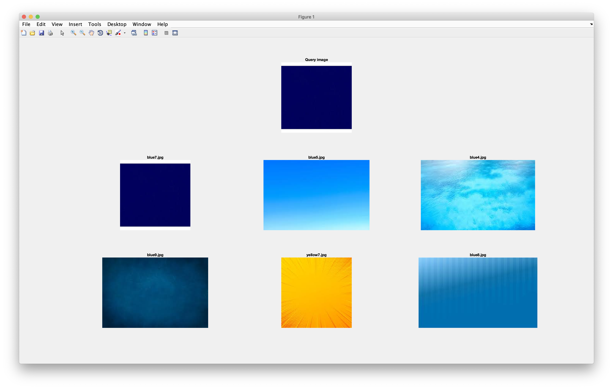
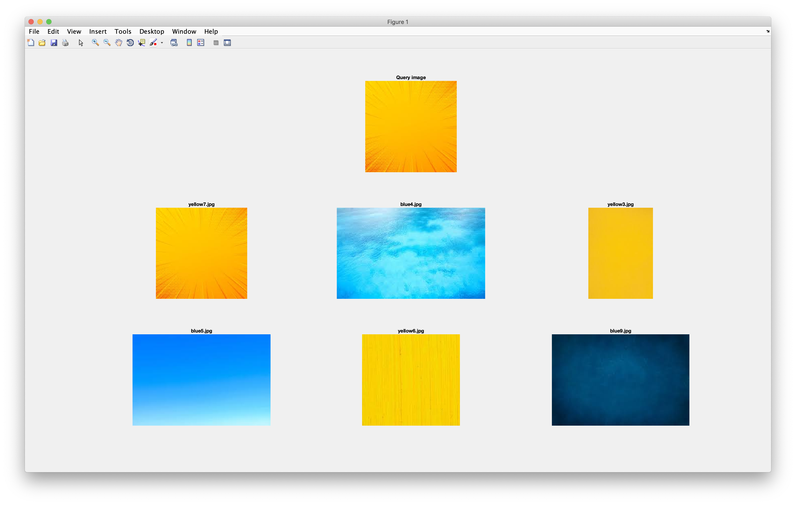

# CSE3018 Content Based Image and Video Retrieval Lab

## WEEK3 - Implementing a CBIR system using color histogram descriptors as features

### Available folder:

* _./images/_ - Folder that contains the images belonging to two different categories. (Based on the extensions of the images, the regex for the filepath should be modified).
* _./query/_ - Folder that contains the query image used to test the system.
* _./output/_ - Folder that contains sample outputs.

### Available files:

* _lab3.m_ - The script that reads all the images in the image base and calculates the color histogram descriptor of these images. After the calculation of these features, the euclidean distance of each of these images is calculated from the query image and stored in a xls file (The quantization level could be modified in this file).
* _histogram.xls_ - The excel file that contains the color histogram descriptors of each image in the image base along with the euclidean distance of the image from the query image.

### Sample output:

