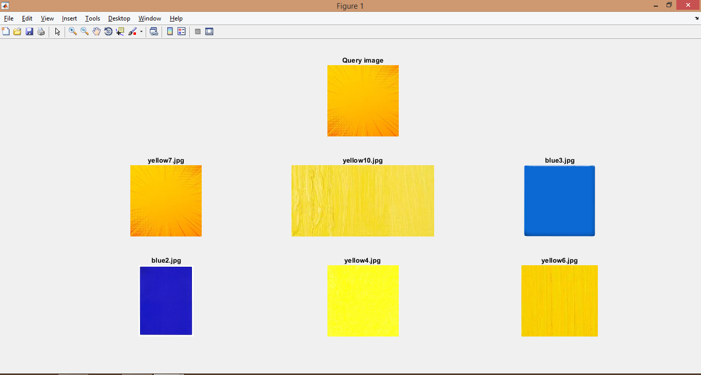
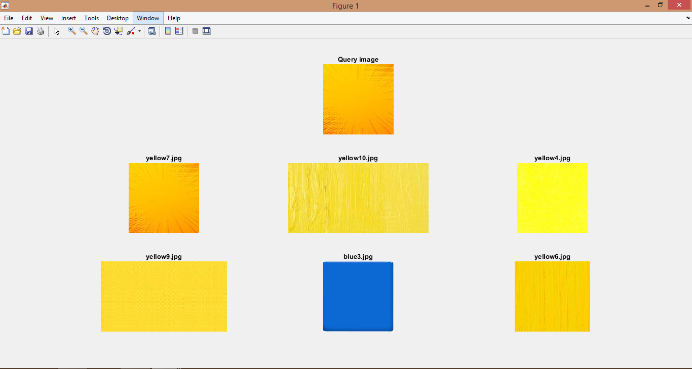
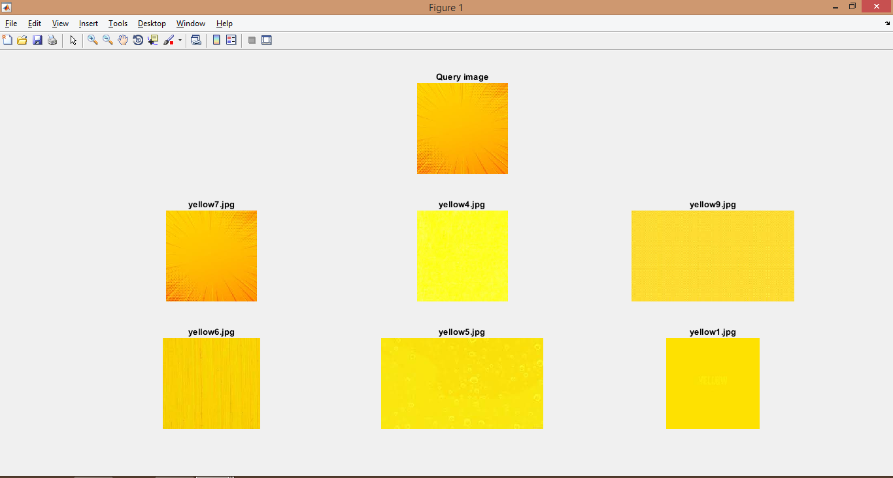

# CSE3018 Content Based Image and Video Retrieval Lab

## WEEK4 - Implementing a CBIR system using color auto correlogram descriptors as features

### Available folder:

* _./images/_ - Folder that contains the images belonging to two different categories. (Based on the extensions of the images, the regex for the filepath should be modified).
* _./query/_ - Folder that contains the query image used to test the system.
* _./output/_ - Folder that contains sample outputs.

### Available files:

* _lab4.m_ - The script that reads all the images in the image base and calculates the color auto correlogram descriptor of these images. After the calculation of these features, the euclidean and manhattan distance of each of these images is calculated from the query image and stored in a xls file (The type of distance used to sort the image for output could be changed in this file also the number of features to be calculated for the correlogram could be changed in this file).
* *color_auto_correlogram.m* - The file that calculates the auto correlogram vector for the input image.[[source](https://www.mathworks.com/matlabcentral/fileexchange/46093-color-auto-correlogram)]
* *get_n.m* - The function gets the validity map of neighbourhood.[[source](https://www.mathworks.com/matlabcentral/fileexchange/46093-color-auto-correlogram)]
* _histogram.xls_ - The excel file that contains the color auto correlogram descriptors of each image in the image base along with the euclidean and manhattan distance of the image from the query image.

### Sample output:

