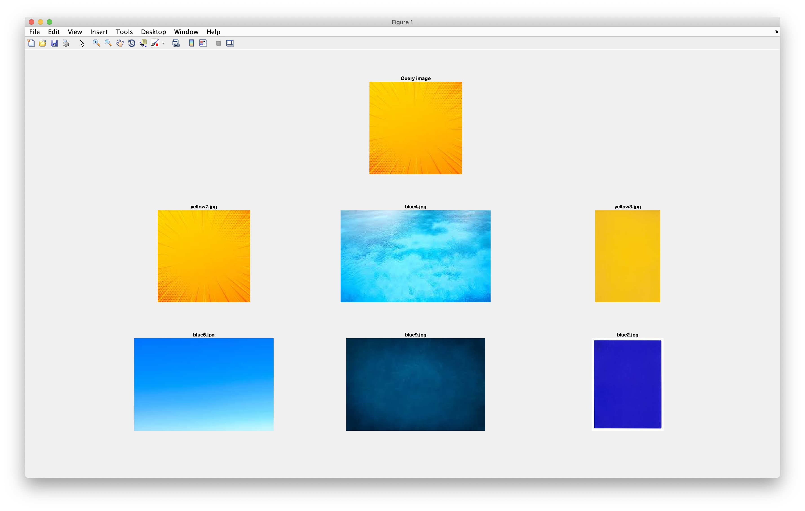

# CSE3018 Content Based Image and Video Retrieval Lab

## WEEK5 - Implementing a CBIR system using color coherence vector descriptors as features

### Available folder:

* _./images/_ - Folder that contains the images belonging to two different categories. (Based on the extensions of the images, the regex for the filepath should be modified).
* _./query/_ - Folder that contains the query image used to test the system.
* _./output/_ - Folder that contains sample outputs.

### Available files:

* _lab5.m_ - The script that reads all the images in the image base and calculates the color coherence vector descriptor of these images. After the calculation of these features, the euclidean distance of each of these images is calculated from the query image and stored in a xls file.
* _getCCV.m_ - The function to find the patches in image for pixel at img(i, j).
* _getCCVfeature.m_ - The script that prepares the input image for calculating the color coherence vector for 16 quantization level (The quantization level and the value of coherence threshold i.e. tao could be changed in this file).
* _ccv.xls_ - The excel file that contains the color coherence vector descriptors of each image in the image base along with the euclidean distance of the image from the query image.

### Sample output:

