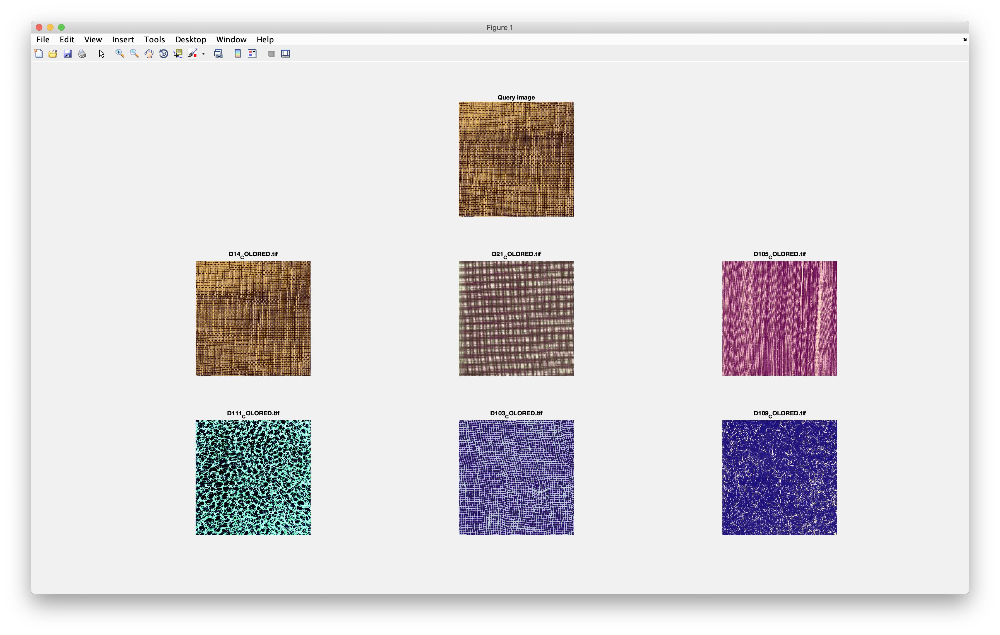

# CSE3018 Content Based Image and Video Retrieval Lab

## WEEK6 - Implementing a CBIR system using GLCM descriptors as features

### Available folder:

* _./textures/_ - Folder that contains the textures.
* _./query_texture/_ - Folder that contains the query texture used to test the system.
* _./output/_ - Folder that contains sample outputs.

### Available files:

* _lab6.m_ - The script that reads all the images in the image base and calculates the GLCM descriptor of these images. After the calculation of these features, the euclidean distance of each of these images is calculated from the query image and stored in a xls file.
* _getGLCM.m_ - Function to return the energy, entropy, contrast and inverse difference moment after calculating the GLCM in vertical as well as horizontal direction for the given quantization level.
* *glcm_features.xls* - The excel file that contains the GLCM descriptors for different quantization level of each image in the image base along with the euclidean distance of the image from the query image.

### Sample output:

