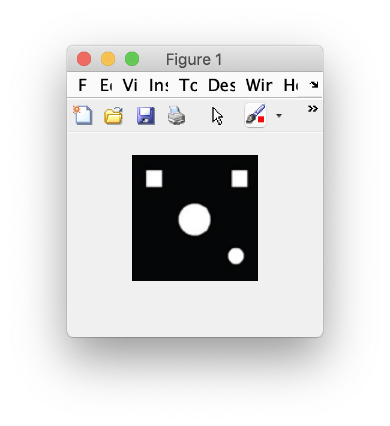
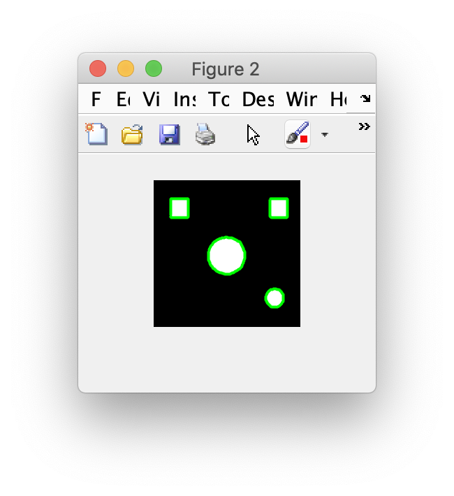
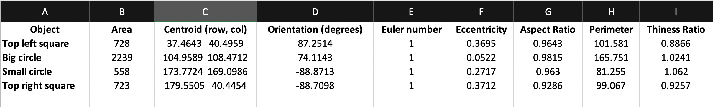

# CSE3018 Content Based Image and Video Retrieval Lab

## WEEK7 - Feature extraction and shape analysis on shape images

### Available folder:

* _./images/_ - Folder that contains the images for shape analysis.
* _./output/_ - Folder that contains sample outputs.

### Available files:

* _lab7.m_ - The script that reads all the images in the image base and extracts their shape features.
* _getShapeStats.m_ - The scripts calculates the different shape features for the input image and displays the intermediate steps.

### Sample output:

